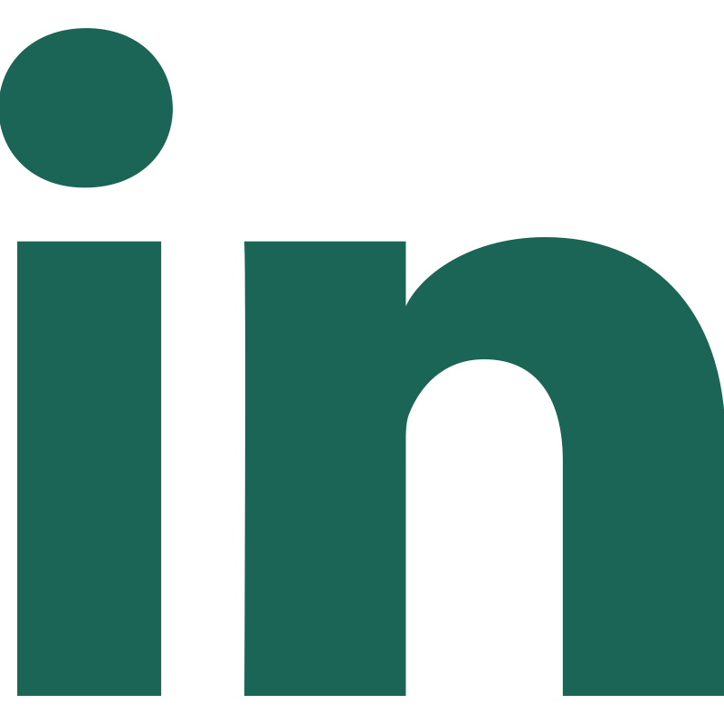

 ### Hi there 
 
With a keen eye for detail and a passion for problem-solving, I quickly discovered my natural aptitude for coding while exploring my curiosity for technology👩🏻‍💻.

My commitment to continuous learning and improvement is an essential part of my way as a Python backend developer. I realize that technology is constantly evolving, and staying up to date with the latest tools and techniques is crucial. ✨

### 🔧 Technologies & Tools

  <i>How to reach me: </i>

  

    
    
    
  

